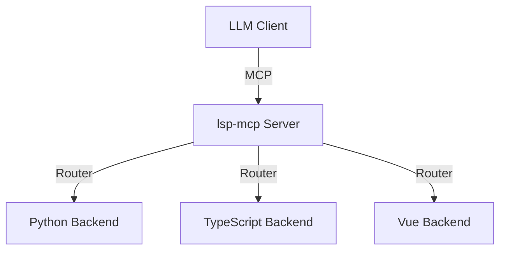

# GEMINI.md - Project Context

## Project Overview
This repository contains a **Unified Model Context Protocol (MCP) Server** (`lsp-mcp`) that acts as a bridge to various Language Server Protocol (LSP) backends. It provides code intelligence features (hover, definition, references, etc.) to LLM agents like Claude Code and Gemini.

The project is a **monorepo** consisting of:
*   **`lsp-mcp`**: The main entry point. A unified server that routes requests to the appropriate language-specific backend.
*   **`backends/python/python-lsp-mcp`**: Python backend utilizing `Rope` (refactoring) and `Pyright` (type checking).
*   **`backends/typescript/typescript-lsp-mcp`**: TypeScript/JavaScript backend using the official TypeScript Language Service.
*   **`backends/vue/vue-lsp-mcp`**: Vue backend using the Vue Language Server.

## Architecture
The `lsp-mcp` server uses a "lazy loading" architecture. It runs as a main process and spawns sub-processes for specific languages (Python, TypeScript, Vue) only when tools for those languages are requested.

## Build & Run Commands

### 1. Unified Server (`lsp-mcp`)
*   **Directory**: `lsp-mcp/`
*   **Build**: `bun run build`
*   **Run (Dev)**: `bun --watch src/index.ts`
*   **Run (Prod)**: `bun dist/index.js`
*   **Test**: `bun run test`

### 2. Python Backend (`backends/python/python-lsp-mcp`)
*   **Directory**: `backends/python/python-lsp-mcp/`
*   **Manager**: `uv` (recommended)
*   **Run Locally**: `uv run python-lsp-mcp`
*   **Test**: `uv run pytest tests/ -v`

### 3. TypeScript Backend (`backends/typescript/typescript-lsp-mcp`)
*   **Directory**: `backends/typescript/typescript-lsp-mcp/`
*   **Build**: `bun run build`
*   **Test**: `bun run test`

### 4. Vue Backend (`backends/vue/vue-lsp-mcp`)
*   **Directory**: `backends/vue/vue-lsp-mcp/`
*   **Build**: `bun run build`
*   **Lint**: `npm run lint` (in `backends/vue/language-tools`)

## Development Conventions

### Code Style
*   **TypeScript**: Use ESM modules. Follow patterns in `lsp-mcp/src/`. Keep tool schemas and routing consistent.
*   **Python**: Use 4-space indentation. Follow `snake_case` for modules and functions. Source code is in `src/rope_mcp/`.

### Testing
*   **TypeScript**: Uses `bun test`. Tests are located in `test/` folders within each package.
*   **Python**: Uses `pytest`. Tests are located in `tests/`.
*   **Requirement**: Add tests for any new tools or behavioral changes.

### Commit Guidelines
*   **Format**: Short, sentence-case statements (e.g., "Fix version reporting").
*   **No Scopes**: Do not use scopes like `feat(scope):`.
*   **Content**: Focus on *why* the change was made.

## Agent Skills & Resources
The `skills/` directory contains specific guidance for agents:
*   `skills/code-navigation.md`: How to use hover, definition, references.
*   `skills/refactoring.md`: Safe cross-file refactoring workflows.
*   `skills/code-analysis.md`: Symbols, diagnostics, and search.
*   `skills/rules.md`: Best practices for using LSP tools.

## Key Configuration (Environment Variables)
*   `LSP_MCP_LOCAL=1`: Enable local development mode (uses local backend paths instead of `npx`/`uvx`).
*   `LSP_MCP_PYTHON_ENABLED`: Enable/disable Python backend.
*   `LSP_MCP_TYPESCRIPT_ENABLED`: Enable/disable TypeScript backend.
*   `LSP_MCP_AUTO_UPDATE`: Auto-update backends on startup (default: true).

## Important Notes
*   **Do not commit** `.ropeproject/` directories.
*   **Do not commit** `dist/` directories unless specifically instructed (usually handled by CI/release).
*   Always verify changes with the project-specific test command.
